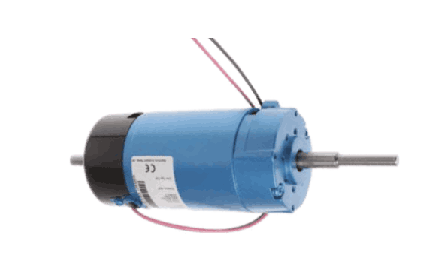

# Lab : Real Time DC motor control

## Authors

* Romain DELPOUX \(Romain.Delpoux at insa-lyon.fr\), Assistant Professor, INSA de Lyon, Laboratoire Ampere UMR CNRS 5005.
* Lubin KERHUEL \(Lubin.Kerhuel at microchip.com\), Software Engineer, Microchip Technology Inc.

## Introduction

This project is offered to the 5th year students in the [electrical engineering departement](http://ge.insa-lyon.fr) of [INSA Lyon](http://www.insa-lyon.fr) for the [CCSA](http://ge-option5a.insa-lyon.fr/content/ccsa-commande-de-convertisseurs-et-de-systemes-dactionnement) option. This project details the steps for the real time implementation of a velocity DC motor control on Microchip dsPIC microcontroller target. The programming environment for this project is the rapid protoype Matlab/Simulink toolbox [MPLAB Device Blocks for Simulink](https://www.microchip.com/DevelopmentTools/ProductDetails/sw007023#utm_source=MicroSolutions&utm_medium=Link&utm_term=FY16Q4&utm_content=DevTools&utm_campaign=Article).

The project details the following points

1. Getting started with the programming environment and harware setup until the openl-loop control of the DC motor which means :
   * Two PWM signals to control the motor DC voltage through a H bridge structure using MOSFET.
   * Two ADC channels providing the respectively the board potentiometer positon to impose a reference and the current measurement from a shunt resistor. 
   * QEI peripheral to provide shaft position and speed
   * UART connection to the computer for the data analysis. 
2. Modeling and control loop design of the DC motor.

   * A recall on the motor modeling will be exposed.
   * A basic control strategy based on state space representation will be proposed.

   Note that the modeling and the control of the DC motor are supposed as prerequisites for this project and this section is a reminder only. That's why the speed control algorithm will be given and not developped here.

3. Simulation of the DC motor
   * A control strategy for the speed control of the DC motor is proposed. The simulation file is implemented using double data types variables and variaible-step solver to simulate and ideal continuous DC motor closed loop control.
   * Degradation of the control to adapt to the real-time implementation on dsPIC. It means constant sampled control and 16-bits fixed point variables. 
   * Comparison between the ideal and the real implementation cases. 
4. Experimental validation
   * Real-time implementation of the sampled fixed point control and comparison with the theory. 
   * Back to modeling with the analysis of experimental results.
   * Updating models, commands and experimentation.

## Getting started

[MCLV V2 board setup with Simulink for DC motor](https://github.com/rdelpoux/INSA_TP_CommandeTempsReel_MCC/tree/e5152949a3f60ba1e0c75a98ebc9fb2c29007742/Experimentations/01_Hardware_setup/README.md)

## Modeling and control loop design of the DC motor

[Modeling and control loop design](https://rtdc.ctrl-elec.fr/control-loop-design)

## Simulation of the DC motor

[Data recording, Simulation and Validation](https://github.com/rdelpoux/INSA_TP_CommandeTempsReel_MCC/tree/e5152949a3f60ba1e0c75a98ebc9fb2c29007742/Experimentations/05_Log_Model_And_Simulation/README.md)

## Experimental validation

