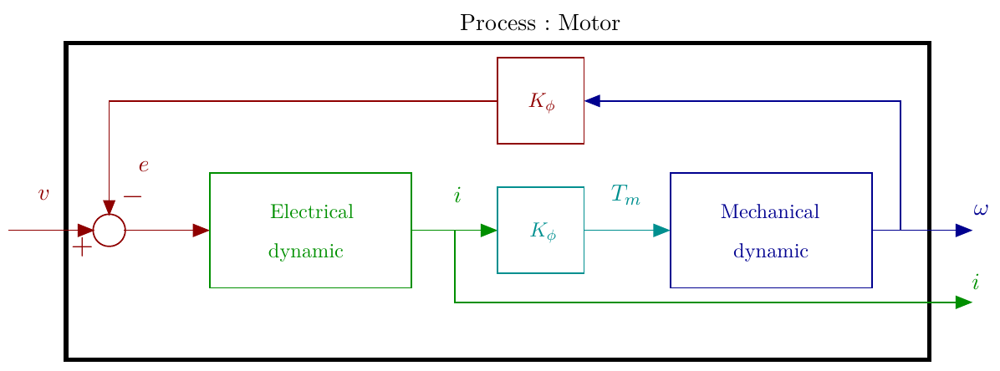

# DC motor modeling and control loop design

## Motor description

## System modeling

**Electric equation:**

From kirchhoff's voltage law :

$$L\frac{di(t)}{dt} =v(t) - Ri(t) - e(t)$$

**Mechanical equation:**

By Newton's law:

$$J\frac{d\omega(t)}{dt} = \sum T(t) = T_m(t)-f\omega(t)$$

where $$c(t)$$ is the total torque applied on the rotor

**Electro-mechanical coupling:**

The back EMF is proportional to speed :

$$e(t) = K_e \omega(t)$$

$$K_e$$ : electromotive constant $$(V.rad^{-1}.s)$$

The motor torque is proportional to current :

$$T_m(t) = K_T i(t)$$

$$K_T$$ : Torque constant $$(N.m.A^{-1})$$

The mechanical power produced by the DC motor is $$T_m\omega = K_Ti\omega$$. The electric power $$P_e = vi$$ delivered by the source goes into heat loss in the resistance $$R$$, into stored magnetic energy in the inductance $$L$$ and the remaining quantity $$iK_e\omega$$ is converted in mechanical energy $$T_m\omega$$. It leads to $$T_m\omega = K_ci\omega = K_ei\omega$$ whether $$K_c = K_e = K_\phi$$ \(Chiasson2005\).

## Motor Bloc Diagram

## References

\(Chiasson2005\) Chiasson, J.-N. \(2005\). Modeling and High-Performance Control of Electric Machines \(IEEE Press\).

## References

