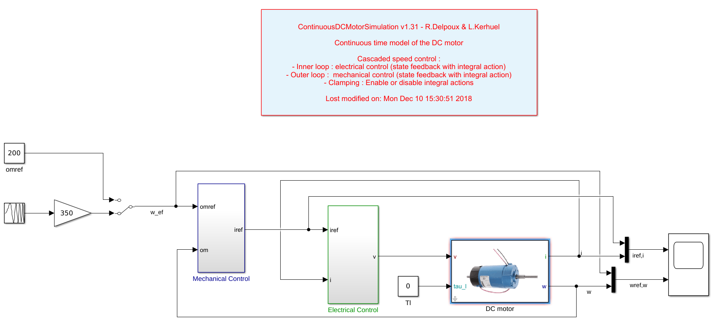
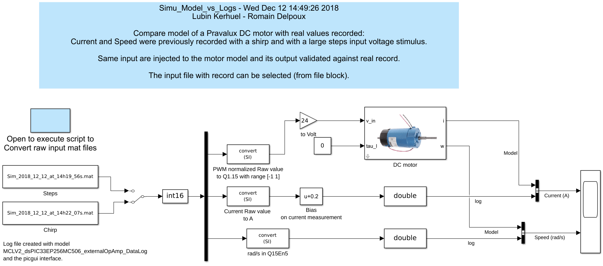

# Simulation

## Simulation

1. Download the simulation files [here](https://github.com/rdelpoux/INSA_TP_CommandeTempsReel_MCC/raw/master/LABMatlabFiles/01_Simulation/Simulation.zip). These files are Matlab/Simulink files for the simulation of the control law proposed section [DC motor modeling and control loop design](https://rtdc.ctrl-elec.fr/control-loop-design).
2. For the realtime application the controlleur needs to be sampled. The inner electrical control loop will be sampled à 20kHz \(PWM frequency\). The outer mechanical control loop will be sampled at 500Hz. For this purpose, use the Sampling block commented in the simulation. Apply the sampled control to the downloaded model and compare with the continous control.
3. The DSpic support 16bits fixed point variables. The control needs to be converted to use 16bits fixed point variable only. Here use the quantization block. Compare the this control with the two previous one.

## Comparison between model and simulation

Here the objective is to compare the difference between the modeling and motor real measurement.

1. Download the model [here](https://github.com/rdelpoux/INSA_TP_CommandeTempsReel_MCC/raw/master/LABMatlabFiles/05_Log_Validation/LogVsSimu.zip)
2. Using the simulink file MCLV2_dsPIC33EP256MC506_internalOpAmp_DataLog_R2017a.mdl recaord real data from the motor.
3. Compare the simulation with the real measurment using the simulink file Simu_Model_vs_Logs_R2017a.mdl

